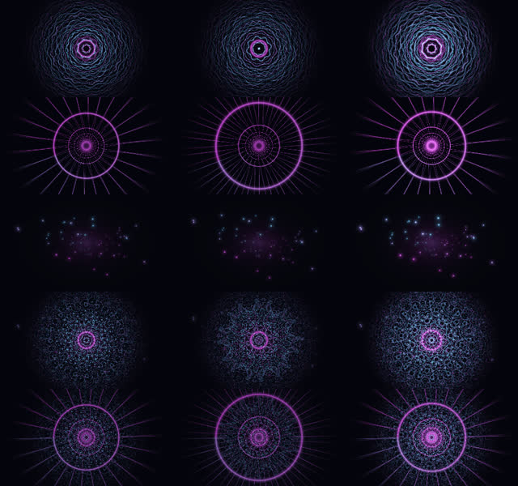

# 雲端軟體驗證 · 2026-10-06

本次只在 Linux 雲端進行。從 PR #1 的 `92ecff5265e1b131d706666a4cc6ea9910125674`
取得遠端分支；沒有存取或覆蓋 Mac 上尚未提交的修改，沒有啟動 TouchDesigner、
更改音訊輸出、進入全螢幕或使用真實 AI 帳號額度。

完整回歸測試：以 `AMV_TEST_EGL=1` 執行，全數 **777 通過**，包含真正 EGL 渲染測試。
一般未啟用 EGL 的執行方式會依設計跳過其中六項。shell 語法、Python compileall 與 `git diff --check` 通過。
下方另列實際一小時耐久結果；測試數量本身不代表演出時間。

## 驗證範圍

V1 的 Python／OSC 控制流程、合成音訊、故障恢復、手動接管及獨立 GLSL 渲染。
完整 V1 實機演出、V2 Scene Engine 與 V3 Performance Memory 仍不能由這些結果宣稱完成。

官方 [TouchDesigner 下載頁](https://derivative.ca/download) 提供 Windows 與 macOS 版本。
此 Linux 測試沒有執行 TD 引擎，軟體渲染也不代表 Mac GPU／Metal 的效能。

## 發現與修復

- 原本只對每個 AI 程序設 30 秒 timeout；加上 18 秒請求週期，失效後可能到第 48 秒才有新規則決策
- 原本檢查手動模式後到發布之間有競態，已將模式切換、關閉與最終發布序列化
- 真實延遲短循環另抓出 rule→GPT 重設 freshness、造成 31 秒空窗；自動模式切換現在保留上一筆成功發布的時刻
- GPT 掛起時明確切到 rule，下一個 tick 就會發布規則決策，不必等待舊 AI timeout；舊結果仍不能覆寫
- UDP 傳送錯誤不再讓 status／手動 heartbeat 終止主迴圈；有錯誤計數與節流警告，部分發送失敗不附完成 heartbeat
- 先發新 transition 控制值，再發 scene／palette 等目標，避免 TD 用上一筆 transition 處理本筆場景
- OSC 特徵限定六個合約欄位並拒絕 NaN、Infinity、未知欄位與越界值
- 導演與 watchdog 改在偵測 tick 服務，不受 `--rate 0` 或低 console 更新頻率停用；沒有音訊時仍能退出
- 啟動器預設規則模式，安裝依賴、改音訊路由、使用 AI 各自需要明確旗標；子程序群組與終端機清理有 Linux 測試
- 修正一個依賴測試機剩餘空間的測試；真正的磁碟容量檢查仍保留

watchdog 的 25 秒預算使用獨立 monotonic 牆鐘。請求排程與故障恢復另以正常 13 秒
模擬 AI 延遲檢查，不能只靠瞬間回傳的假 AI 判定可恢復。

## 獨立 GLSL 實際渲染

未修改 `td/shaders/visualizer.frag`，用 ctypes 存取既有 EGL／OpenGL；只有少量 TD 宿主
介面替身（正規化 vUV 與 identity TDOutputSwizzle），沒有將 TD 引擎假裝成已執行。

- 五個場景全部編譯、link 並渲染成功
- 120 張 320 × 180 RGBA32F 影格全部有限值、範圍 [0,1]、alpha=1
- 119 張有空間圖形；`particle_field` 搭配 `particle_mode=none` 刻意只剩均勻暗背景
- 每個場景會隨時間、音訊與色盤變化，五個基準場景各不相同
- 另外測過 161 × 91、128 × 128 與 builder 的 1280 × 720；也確認錯誤 shader 會失敗且隨後能恢復
- 目前 shader 不直接使用 mid／kick，fractal_temple 不受 camera_speed 影響；kick 的切場邏輯屬於另一層

環境：Python 3.12.14、numpy 2.5.3、Mesa 25.0.7、EGL 1.5、OpenGL 4.5、
llvmpipe LLVM 19.1.7。這是軟體渲染，不提供 GPU FPS 結論。



列由上至下：fractal_temple、tunnel、particle_field、kaleido_mesh、projectm_blend。
欄由左至右：基準 t=12 秒、t=14 秒、t=12 秒加強音訊。
[完整 float32 數值與來源 hash](cloud-shader-results-2026-10-06.json)。

重跑：

```sh
uv sync --locked
uv run --no-sync pytest -q
AMV_TEST_EGL=1 uv run --no-sync pytest -q tests/test_cloud_shaders.py
uv run --no-sync python tools/render_shaders.py
```

六個 EGL 測試預設跳過；明確啟用後，缺少 EGL 或 shader 編譯錯誤都會讓測試失敗。
渲染矩陣與五場景圖片由 `tools/render_shaders.py` 寫入 `artifacts/cloud-verification/shaders/`。

## 一小時軟體耐久

**PASS：實際跑完 3,600.104 秒，所有檢查通過，開始與結束的來源 hash 相同。**

2026-10-06 05:58:04.562 → 06:58:04.831 UTC（含 0.161 秒清理）。
這是軟體控制路徑的實際牆鐘一小時，沒有用短測或壓縮時間取代。

| 指標 | 實際結果 |
|---|---:|
| 特徵 UDP 傳送／收到 | 216,006／216,006 |
| 合規決策／heartbeat | 199／214 |
| 完成的故障階段 | 36，全部 30 秒內 fallback |
| 最慢故障接手 | 25.021 秒 |
| 自動模式最長決策間隔 | 25.101 秒 |
| 完成的 AI 恢復窗口 | 23，每次至少 2 筆模擬 GPT 決策 |
| 手動模式被導演覆寫 | 0 |
| 非預期錯誤／UDP 發送錯誤 | 0／0 |
| 最大特徵間隔 | 0.127 秒 |
| 取樣 RSS 峰值 | 44,920,832 bytes（42.84 MiB） |
| 結束後殘留測試 thread／subprocess | 0／0 |

來源基底為 `92ecff5265e1b131d706666a4cc6ea9910125674` 加本次尚未提交的修改；
所有 runtime／test 檔案的 SHA-256 合計識別碼為
`0f726bbbfeba7e453552fb84a24583d95f8d5e96d8287bc4bc3633d52c2657cb`。
[完整檢查、逐次故障／恢復、資源與逐檔 hash](cloud-endurance-results-2026-10-06.json)。

`tools/cloud_endurance.py` 使用合成 48 kHz PCM、真正的 numpy 特徵萃取與 localhost UDP，
經過 production Sidecar／DirectorLoop／CodexClient，最後到軟體 UDP 接收器。
AI 程序固定指向 repo 的 `fake_codex.py`，不會尋找真實 Codex 或讀取帳號。
production profile 的成功回應實際等待 13 秒，掛起程序的 timeout 為 30 秒；
包含不用切模式的故障恢復、手動接管與切回 GPT。恢復前 30 秒開始播放固定編曲的合成 PCM，
並以同編曲的峰值 PCM 校準測試來源的 Normalizer，讓真實 SectionDetector 自行穩定下來。
每個 PCM block 仍走 production 特徵萃取、預設 decay=0.999 與 UDP，沒有強制段落標籤或
事後改特徵值。這用來隔離「AI 能否恢復」；其他階段仍覆蓋四種段落。

先前 304 秒循環有一個 31.042 秒自動決策空窗，報告保留為 failed，沒有算成通過。
它同時驗證 18,246 個 UDP 特徵全部收到，並促成上述模式切換時間戳修正。
另一次 797 秒測試因輸入校準不足，恢復段落仍在變化而正確拒絕過期 AI 回覆，已停止並保留
failed／full_hour=false 結果。測試來源修正後，另以三循環離線 PCM replay 確認所有 3,360 個
恢復期間樣本均為 steady、kick 持續，其他期間仍有四種段落；這項加速檢查不是牆鐘耐久證據。

```sh
uv run --no-sync python tools/cloud_endurance.py --duration-seconds 3600 \
  --output artifacts/cloud-verification/endurance/hour
```

報告分開記錄實際牆鐘、完整故障循環、AI 恢復、手動接管、UDP、記憶體／thread 與退出結果。
只有實際完整一小時、production timing 且所有檢查通過，才能稱一小時軟體耐久通過。

## CI 與仍待驗收

新增 Linux Python 3.11／3.12 的 portable regression workflow，只有 `contents: read`、
沒有 secrets、部署或合併動作。它不自動啟動 AI／音訊，也不把一小時耐久塞進每次 PR 測試。
這份驗證完成時，程式與紀錄仍保存在雲端，GitHub workflow 尚未執行。
後續公開更新及 CI 狀態以 PR #1 的最新提交與檢查紀錄為準；本報告保留當時的實測結果。

本次無法驗收：Mac 上 `.toe`、TouchDesigner／Metal、穩定 60 FPS、AirPods／Bluetooth
音畫延遲、實體 MIDI、Syphon／NDI／projectM、真實 AI 額度、完整實機演出。
既有實機短測仍見 [2026-09-08 紀錄](runtime-verification-2026-09-08.md)，不能與本次軟體結果合併成完整演出 PASS。
