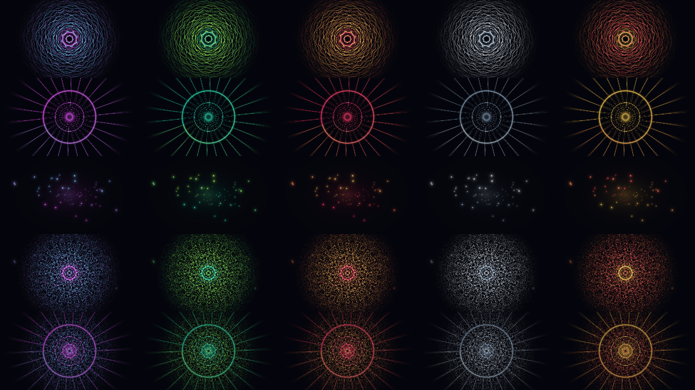
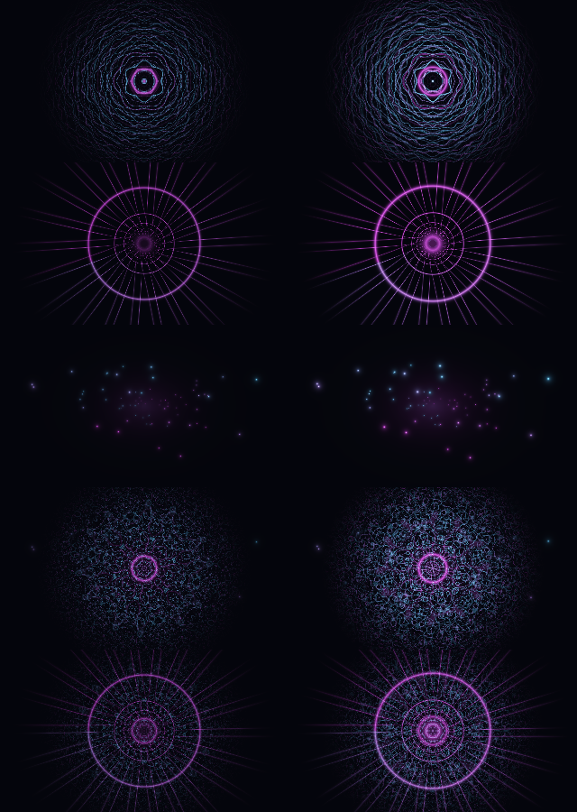

# Linux 實際畫面驗證 · 2026-10-06

**Linux 動態畫面與 AI 控制整合已通過 970 項測試；粒子關閉靜止問題已修正，修正版本真正一小時渲染的 18 項驗收全部通過。**
先前控制路徑與真正一小時 EGL／OpenGL 渲染都有完成紀錄；它們各自對應當時的來源版本及測試情境。

## 最後整合測試找到的問題

220 秒的 PCM→UDP→Sidecar→模擬 AI 子程序→UDP→Linux 控制器→真正 EGL 圖像測試，
38 項條件中 37 項通過。唯一失敗是 AI 合法選擇 `particle_field` 與 `particle_mode=none` 時，
原本 shader 只剩固定背景，出現 14.234 秒完全相同的近黑影格。

當次完整測試為 **929 通過、1 失敗**，失敗記錄保留，不把它算成成功。
同次的 AI 逾時接續、恢復、手動接管、舊回覆抑制及資源清理皆通過；
畫面不動的原因是這個有效參數組合，並非渲染執行緒卡死。

修正採用 Linux 合成器的明確視覺備援：只有這個原本空白的組合改用既有 `kaleido_mesh` 的不含粒子動畫，
保留「關掉粒子」的意思、原始 shader、控制值與 wire 資料。修正版本的測試及耐久結果另記，
不覆寫下方較早版本的一小時證據。
這個保護只實作在 Linux 合成器；原生 TouchDesigner 路徑仍需整合這個邊界情況並驗收。

修正後完整測試為 **970 通過，沒有跳過**，耗時 252.70 秒。重跑的 220.000126 秒整合測試，
**42 項驗收全部通過**：

- 6,559 張實際畫面、7,925 次原始 float32 繪圖，沒有黑畫面或相同畫面凍結
- 13,200／13,200 個音訊特徵、364／364 個控制封包，12 筆完整套用的導演決策
- 1,285 張明確記錄「要求 particle_field／實際 kaleido_mesh」的備援畫面，每張都有變化
- 模擬 AI 真正掛起期間的 872 幀、手動模式的 583 幀，畫面全部持續變化
- 手動控制值保持不變，13 秒後才完成的舊 AI 回覆沒有覆蓋手動接管
- 使用同一 `gpt` 模式恢復健康回覆後，新的 AI 完整畫面於第 135.306 秒抵達
- 原始來源 hash 未變，GL、socket、thread、子程序都正常釋放

掛起的模擬子程序於第 90.442 秒開始、第 120.468 秒由 30 秒 timeout 結束。
freshness watchdog 於第 97.482 秒發布規則備援，第 97.502 秒抵達 UDP，
第 97.546 秒開始改變實際渲染控制，第 102.612 秒完成轉場。門檻仍是距離上次有效發布 25 秒；
這次故障開始距上次發布已有約 18 秒，因此不是宣稱通用的「7 秒 timeout」。

每筆決策都有來源、heartbeat、wire 收到時間、首幀與轉場終點的追蹤；
每幀另記要求的控制值與真正繪製的 shader 分支。
[完整 AI／畫面整合結果](linux-ai-integration-results-2026-10-06.json)。

這裡的 AI 是固定呼叫 repo 內的模擬子程序，沒有呼叫真實模型、讀取憑證或使用額度。

## 已交付的可播放影片

`ai-vj-linux-preview-120s.mp4`：120 秒、640 × 360、30fps、H.264／AAC，10,995,080 bytes。
SHA-256：`1eae79717e69b965c881325506a139cad8c5799b13cf7c4c266f88f4c8fbde31`。

它由實際 Linux GLSL 影格加上自行合成的 48kHz 雙聲道音樂編碼而成，沒有用生成影片取代畫面。
獨立工具已把壓縮後的檔案完整解碼：3,600 幀、每聲道 5,760,000 個音訊樣本，時間戳及長度對齊。
抽樣圖片包含五場景、轉場、drop、66–96 秒的手動保留及 90.3 秒的下一個 kick 切換。

示範影片保留產生時的版本；之後程式補了驗收、外部 OSC 與色盤保留。
片中的琥珀色盤在 drop 前短暫出現，完整五場景 × 五色盤另以 25 格實際渲染圖驗證。
原始大檔與精簡交付檔都有獨立解碼紀錄，沒有把重壓縮當作重新渲染。

## 音樂真的有影響畫面

固定畫面時間及控制值，分別輸入靜音與合成 PCM，經過 production FFT／Normalizer／KickDetector，
再走真正 localhost UDP、FeatureReceiver／FeatureBuffer，最後進 Linux 合成器與 EGL shader。

- 1,140／1,140 個特徵封包收到
- 600 張 float32 圖形影格檢查通過
- 五場景全部產生像素差異，平均 RGB 差值約 0.00691–0.05879
- 配對圖片已抽樣目視，差異來自畫面區域，而非字幕

這證明輸入到畫面的連接有作用。音量校準會先讀來源前兩秒，之後每 100ms 分析，
另有 80／180ms 的升降平滑；不宣稱精準鼓點辨識或零延遲。

## 控制與轉場

Linux 控制器只在完整、有效且順序正確的 OSC 決策收到 heartbeat 後套用，避免半筆資料改畫面。
場景、色盤與離散控制用真正的多次 GLSL 渲染加權交疊；連續參數按拍數平滑。
手動覆寫會取消該欄位的舊目標，保留 30 秒。

控制器 90 個單元測試通過。影片中的手動鏡頭速度在 66–96 秒共 900 幀保持一致，
90 秒的新導演目標沒有蓋掉它。另看過 12 個控制邊界附近的 59 張解碼影格，
沒有意外黑畫面或平滑轉場終點的跳動。

外部 OSC 有獨立封包計數；`external` 模式的段落由外部資料決定，其他模式採用本機音訊分析。
這些是 Linux 實作，沒有執行 TD 的節點網路。

## 效能與耐久

### 修正後的正式一小時：通過

2026-10-06 約 09:15:29–10:15:29 UTC，實際計時 **3,600.000107 秒**。
**18／18 項預先設定的條件全部通過**，來源保持不變，結束後資源已釋放：

- 107,805／108,000 個目標畫面時段完成，略過 195 個；完成率 99.8194%，有效 29.946fps
- 115,001 次真正 GLSL 繪製，全數檢查原始 float32 數值
- **6,849 張粒子關閉備援畫面**，明確分開記錄要求與實際場景
- 仍真正繪製五個 shader 場景分支，其中一般粒子場景 16,143 次、kaleido_mesh 29,742 次
- 零黑畫面、零完全相同影格凍結、零 OSC 錯誤
- 215,994／215,994 個音訊特徵封包、1,662／1,662 個控制封包完整收到
- 實際分析 172,800,000 個 PCM 樣本，74 次 drop 變化
- 繪製與合成時間 p95 上界 16ms，最大完整影格間隔 277.36ms

此結果證明修正版本在這台 CPU、320 × 180／30fps 目標下通過長時間實際繪圖，
仍有少量略過時段，不能說完全零頓挫。
[修正版本完整結果與來源 hash](linux-render-particle-safe-endurance-results-2026-10-06.json)。
報告 SHA-256：`dba737d042a04ca1af160f35a746e34778352339af86230d5fe663312afb4b5e`。

啟動前 180 秒即時短測也通過 18 項條件：5,395／5,400 幀，227 張備援畫面，
五個原始 shader 分支皆有實際繪製，最大影格間隔 182.59ms，沒有凍結、黑畫面或錯誤。

### 效能基準與保留的較早版本紀錄

環境：Mesa 25.0.7／llvmpipe LLVM 19.1.7，沒有 GPU 裝置或圖形桌面。
五場景單獨測試的最低吞吐量約為：320 × 180 的 94fps、640 × 360 的 25fps、1280 × 720 的 9.3fps。
完整 640 × 360 示範的基準輸出曾用 138.84 秒完成 120 秒影片，因此它是離線輸出。

正式長測前，320 × 180／30fps 的 90 秒即時測試已通過全部 17 項檢查：
2,700／2,700 幀、零略過時段、最大影格間隔 58.50ms，沒有黑畫面、非有限數值、凍結或 OSC 錯誤。

較早版本的一小時真正渲染於 2026-10-06 約 07:54:57 UTC 開始，實際跑完 **3,600.000126 秒**，當次 17 項驗收全部通過。
該展示排程沒有選到上述粒子關閉組合，因此不能代替修正版本的整合驗證：

- 107,843／108,000 個預定畫面完成，略過 157 個時段；完成率 99.8546%，有效 29.956fps
- 115,047 次真正 GLSL 繪圖，每次 float32 數值檢查通過
- 沒有黑畫面、完全相同畫面凍結或 OSC 錯誤
- 每次繪圖＋合成的 p95 上界 17ms；完整影格間隔最長 349.64ms
- 215,994／215,994 個音訊特徵封包，1,662／1,662 個控制封包完整收到
- 分析 172,800,000 個 PCM 樣本，執行 74 次預先準備的 drop 變化
- 暖機五分鐘後的 RSS 取樣維持 131.75–132.70MiB
- 執行期間的來源檔未變，GL、socket、thread 等資源已釋放

這證明該版本在指定排程／CPU／解析度下可長時間渲染，**仍不能說完全零頓挫或涵蓋所有合法參數組合**。
[完整機器可讀結果與來源 hash](linux-render-endurance-results-2026-10-06.json)。

事先訂好的條件包括：完整時間、至少 98% 目標畫面時段、沒有 0.5 秒影格中斷、
沒有 1 秒完全相同畫面、全部五場景／色盤、資料完整、資源清理與來源未變。
不會因為程式跑到結束就自動標成通過。

## 測試與來源

較早展示版本：**897 項測試通過**，來源集合 `c9961a870e24e4952e9589079c33b692bd48f581f549a69adc3d3ea85b83a34c`。
修正後完整版本：**970 項測試通過**，含真正 EGL、FFmpeg、外部 OSC 與模擬 AI 到實際像素。
測試來源集合：`f9a621cdd0d0f75a1ea996c0a44136e3163fe35fbfcd727221bdd4575a2f1723`。
先前已測的一小時控制層之 51 個來源／設定檔逐一比對，全部未改；該份紀錄繼續保留。

證據放在 `artifacts/linux-visual/`：`INDEPENDENT-QA.md`、`qa-delivery/`、`qa-source/`、
`realtime-smoke-final/`、`endurance-hour/`、`ai-integration-220s/`。重跑命令見 [Linux 使用說明](../README-LINUX.md)。
修正後的正式耐久及短測分別是 `endurance-hour-particle-safe/`、`realtime-smoke-particle-safe/`。

本報告完成時，公開 PR 與 CI 尚未更新；後續狀態以 PR #1 的最新提交與檢查紀錄為準。
TouchDesigner／Metal、實體音訊與 MIDI、外部 projectM、
真實 AI 額度，以及舞台解析度的即時效能，仍屬於未驗收範圍。
